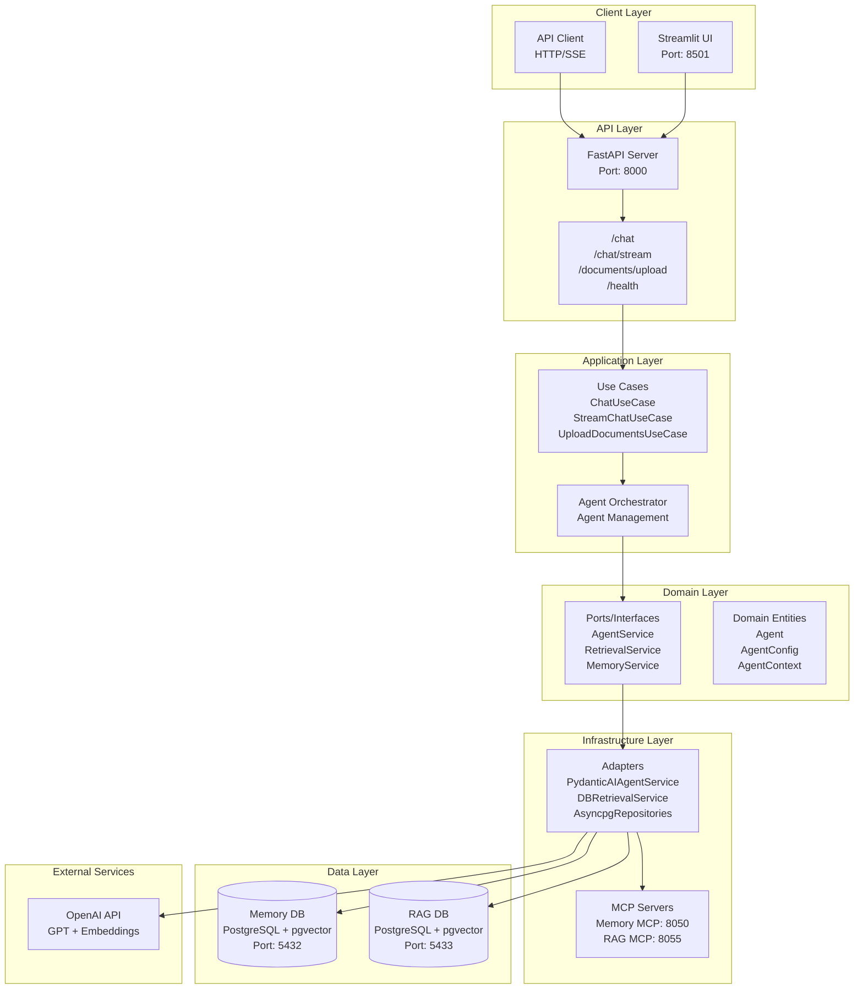
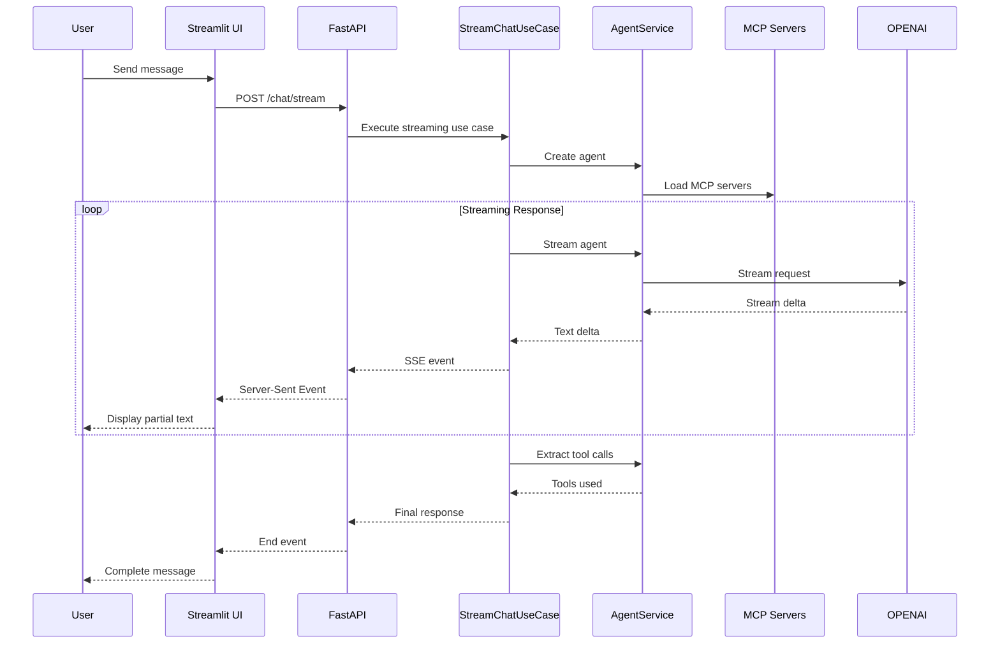
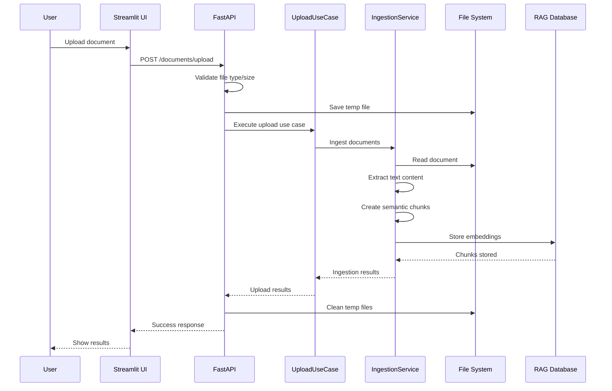
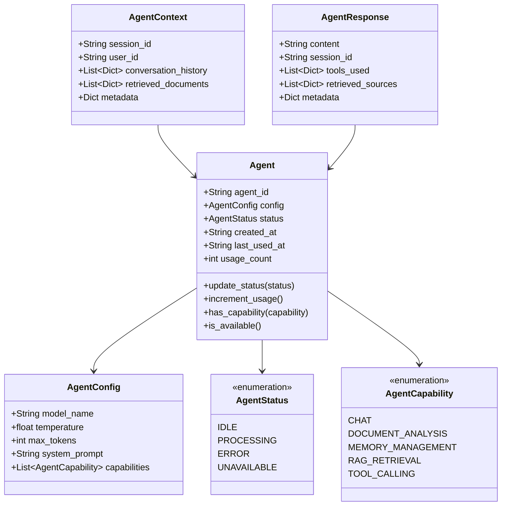
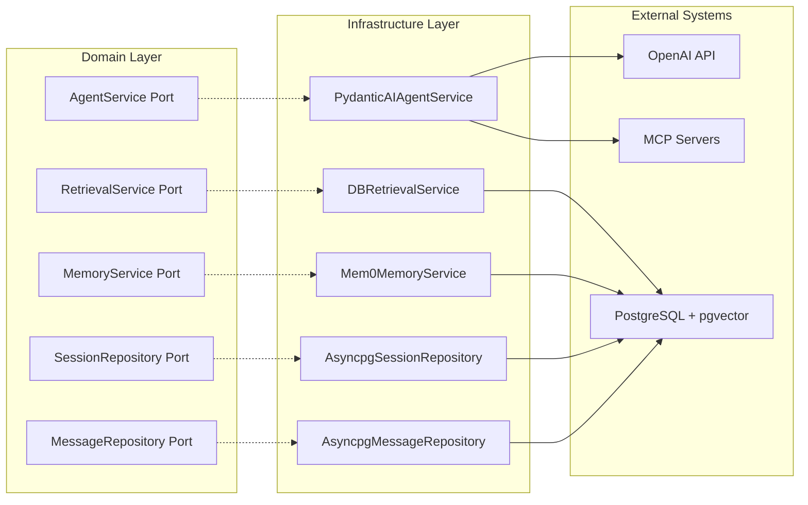
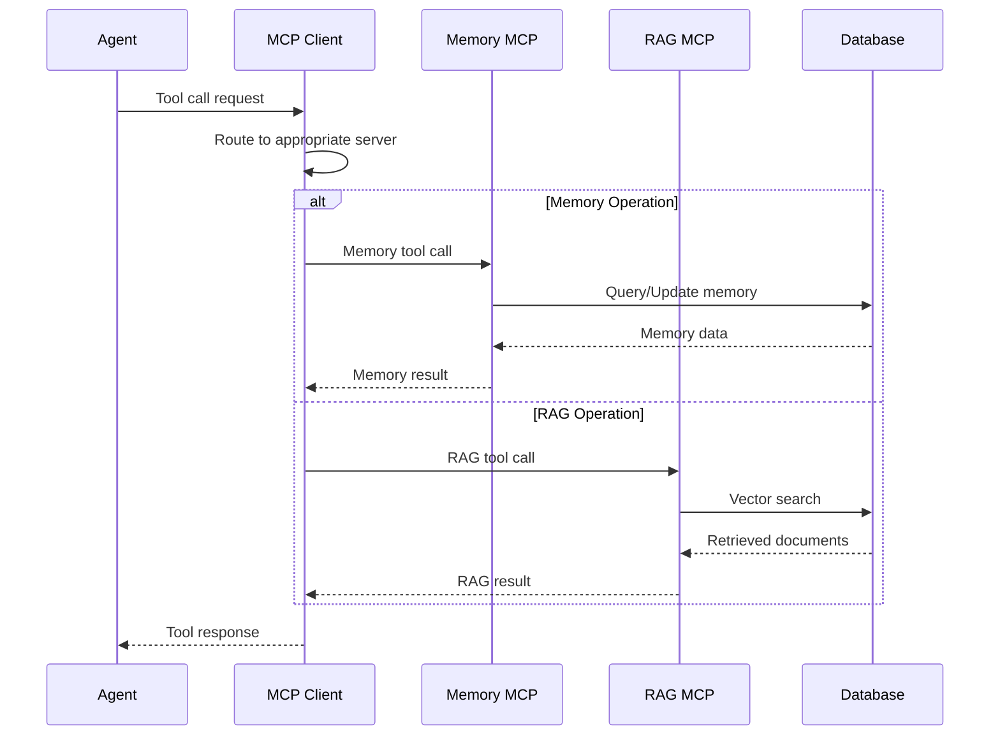
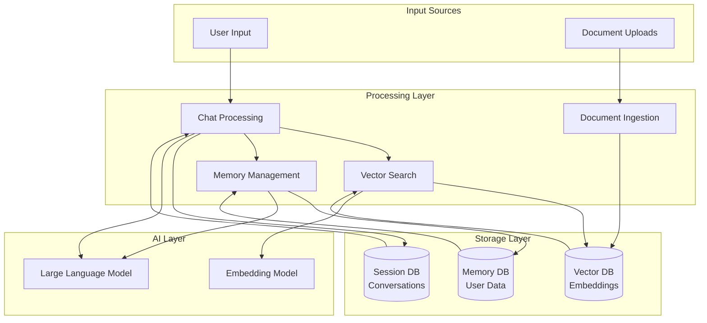

# Agent Tiers

A sophisticated AI agent system built with layered architecture, featuring RAG (Retrieval-Augmented Generation), memory management, and MCP (Model Context Protocol) integration.

## 🚀 Features

### Core Capabilities
- **RAG System**: Vector search and semantic matching for document retrieval
- **Memory Management**: Persistent user memory using Mem0
- **MCP Integration**: Extensible tool integration through Model Context Protocol
- **Streaming Chat**: Real-time response streaming with Server-Sent Events
- **Document Processing**: Support for multiple file formats with semantic chunking
- **Session Management**: Conversation context across multiple sessions

### Architecture
- **Domain-Driven Design**: Clean separation of business logic
- **Layered Architecture**: Domain, Application, Infrastructure, and Interface layers
- **Ports & Adapters**: Flexible dependency injection and testability
- **Docker Support**: Complete containerization with Docker Compose

## 🏗️ Architecture

### System Overview


### Directory Structure
```
src/agent_tiers/
├── domain/                 # Business logic and entities
│   ├── agent/             # Agent domain models
│   ├── prompts/           # Prompt templates
│   └── ports/             # Interface definitions
├── application/           # Use cases and orchestration
│   ├── agent_service/     # Agent orchestration
│   └── use_cases/         # Business use cases
├── infrastructure/        # External integrations
│   ├── adapters/          # Port implementations
│   ├── api/              # FastAPI endpoints
│   ├── db/               # Database connections
│   ├── mcp/              # MCP server implementations
│   └── ui/               # Streamlit interface
└── tests/                # Test suites
```

## 🛠️ Technology Stack

- **Backend**: FastAPI, Python 3.11+
- **Database**: PostgreSQL with pgvector
- **AI/ML**: Pydantic AI, OpenAI GPT
- **Memory**: Mem0 for persistent memory
- **RAG**: Vector embeddings with semantic search
- **MCP**: Model Context Protocol for tool integration
- **UI**: Streamlit
- **Containerization**: Docker & Docker Compose

## 🚀 Quick Start

### Prerequisites
- Docker and Docker Compose
- OpenAI API key

### 1. Clone and Setup
```bash
git clone <repository-url>
cd agent_tiers
```

### 2. Environment Configuration
```bash
# Copy environment template
cp .env.example .env

# Edit .env and add your OpenAI API key
OPENAI_API_KEY=your_openai_api_key_here
```

### 3. Start Services
```bash
# Start all services
docker-compose up -d

# Check service status
docker-compose ps
```

### 4. Access the Application
- **API**: http://localhost:8000
- **UI**: http://localhost:8501
- **API Docs**: http://localhost:8000/docs

## 📖 API Endpoints

### Chat Endpoints
- `POST /chat` - Non-streaming chat
- `POST /chat/stream` - Streaming chat with SSE

### Document Management
- `POST /documents/upload` - Upload and process documents

### Health & Status
- `GET /health` - Service health check

## 🔄 System Flow Diagrams

### Streaming Chat Flow


### Document Upload Flow


## 🔧 Configuration

### Environment Variables
```bash
# Database
MEMORY_DB_NAME=memory_db
MEMORY_DB_USER=memory_user
MEMORY_DB_PASSWORD=memory_pass
RAG_DB_NAME=rag_db
RAG_DB_USER=rag_user
RAG_DB_PASSWORD=rag_pass

# OpenAI
OPENAI_API_KEY=your_api_key

# Upload Settings
UPLOAD_MAX_FILE_MB=25
UPLOAD_ALLOWED_EXTENSIONS=.pdf,.docx,.doc,.txt,.md,.png,.jpg,.jpeg

# API
API_ENV=dev
API_HOST=0.0.0.0
API_PORT=8000
```

### MCP Configuration
Edit `src/agent_tiers/infrastructure/mcp/mcp_config.json` to add new MCP servers:

```json
{
  "mcpServers": {
    "memory": {
      "protocol": "http-stream",
      "url": "http://mcp_memory:8050/mcp"
    },
    "rag": {
      "protocol": "http-stream", 
      "url": "http://mcp_rag:8055/mcp"
    }
  }
}
```

## 🧪 Development

### Local Development
```bash
# Install dependencies
pip install uv
uv sync

# 1. Start databases first
docker-compose up -d memory_postgres rag_postgres

# 2. Start MCP servers
docker-compose up -d mcp_memory mcp_rag

# 3. Run API
python -m src.agent_tiers.infrastructure.api.main

# 4. Run UI (in another terminal)
streamlit run src/agent_tiers/infrastructure/ui/app.py
```

## 🐳 Docker Commands

### Development
```bash
# Build and start
docker-compose up --build

# View logs
docker-compose logs -f api

# Restart service
docker-compose restart api
```

### Production
```bash
# Production deployment
docker-compose -f docker-compose.yml -f docker-compose.prod.yml up -d
```

### Cleanup
```bash
# Stop and remove containers
docker-compose down

# Remove volumes (WARNING: Data loss)
docker-compose down -v

# Remove images
docker-compose down --rmi all
```

## 📚 Usage Examples

### Basic Chat
```python
import requests

response = requests.post("http://localhost:8000/chat", json={
    "message": "What is machine learning?",
    "user_id": "user123"
})

print(response.json()["message"])
```

### Streaming Chat
```python
import requests

response = requests.post("http://localhost:8000/chat/stream", 
    json={"message": "Explain quantum computing"},
    stream=True
)

for line in response.iter_lines():
    if line:
        print(line.decode())
```

### Document Upload
```python
import requests

files = {"files": open("document.pdf", "rb")}
response = requests.post("http://localhost:8000/documents/upload", files=files)

print(response.json())
```

## 🔍 System Components

### Domain Layer Architecture


### Ports and Adapters Pattern


### MCP Server Communication


### Data Flow Architecture


### RAG System
- **Vector Database**: PostgreSQL with pgvector extension
- **Embeddings**: OpenAI text-embedding-ada-002
- **Search**: Hybrid search (semantic + keyword)
- **Chunking**: Semantic chunking for optimal retrieval

### Memory System
- **Storage**: Mem0 for persistent user memory
- **Context**: Session-based conversation context
- **Personalization**: User preference learning
- **Privacy**: Secure data handling

### MCP Integration
- **Memory Server**: User data storage and retrieval
- **RAG Server**: Document search and analysis
- **Extensible**: Easy addition of new MCP servers
- **Protocol**: HTTP-stream for real-time communication

## 🤝 Contributing

1. Fork the repository
2. Create a feature branch (`git checkout -b feature/amazing-feature`)
3. Commit your changes (`git commit -m 'Add amazing feature'`)
4. Push to the branch (`git push origin feature/amazing-feature`)
5. Open a Pull Request

## 📄 License

This project is licensed under the MIT License - see the [LICENSE](LICENSE) file for details.

## 🗺️ Roadmap

- [ ] **Graph Database Integration**: Neo4j or similar for complex relationship modeling
- [ ] **Additional MCP Server Integrations**: Web search, calendar, email, and more
- [ ] **Real-time Collaboration**: Multi-user chat sessions and shared workspaces
- [ ] **Multi-modal AI Integration**: Image generation, voice synthesis, and video processing
